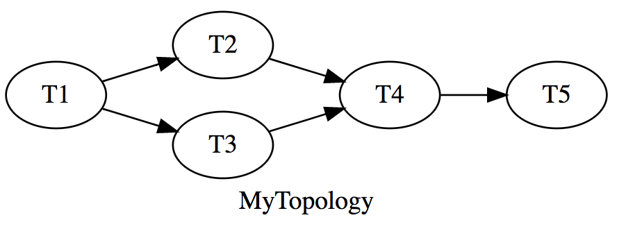

# Tempest

Tempest is a message processing framework, written in Rust, and inspired by Apache Storm (hence the name).

Similar to Storm, this framework constructs `Topologies` for processing messages polled from a `Source` (i.e. Spouts).

Topologies are constructed as `Pipelines` (directed acyclic graphs) of `Tasks` (i.e. Bolts).

## Motivation

- Take high-level Apache Storm concepts and port them to Rust.
- Learn more about processing Redis Streams.

## Design

Take a look at the [design doc](DESIGN.md) for the basic view of how Tempest is structured.

## Topology Example

A simple topology with a single task:

```rust
use tempest::prelude::*;
use tempest_source_redis::prelude::*;

// Source builder
type Source = RedisStreamSourceBuilder<'static>;

// Topology definition
struct MyTopology {}

impl Topology<Source> for MyTopology {
    fn builder() -> TopologyBuilder<Source> {
        TopologyBuilder::default()
            .name("MyTopology")
            .pipeline(
                // Pipeline constructor
                Pipeline::default()
                    .task(T1::default())
            )
            .source(
                // Source constructor
                Source::default()
                    .uri("redis://127.0.0.1/0")
                    .key("some-stream")
                    .group("some-group"),
            )
    }
}

static T1: &'static str = "T1";

#[derive(Default)]
pub struct T1 {}

impl task::Task for T1 {
    fn name(&self) -> &'static str {
        T1
    }

    fn handle(&mut self, _msg: Msg) -> task::TaskResult {
        // Msg handling code goes here...
        // Ack msg with an empty response
        Ok(None)
    }
}

fn main() {
    // Run the topology package
    // The run command will parse all cli args
    rt::run(MyTopology::builder);
}
```

Take a look at the book (coming soon) for more examples.

# Pipelines

Topologies are defined as pipelines, which contain tasks & edges. An edge isn't required if the pipeline only has one task. Edges are defined by `task.name`.

For example, take this topology pipeline:



Assuming these tasks and static variables were previously defined, here's how you would declare the pipeline example above:

```rust
Pipeline::default()
    .task(T1::default())
    .task(T2::default())
    .task(T3::default())
    .task(T4::default())
    .task(T5::default())
    .edge(T1, T2)
    .edge(T1, T3)
    .edge(T2, T4)
    .edge(T3, T4)
    .edge(T4, T5)
```

# Sources

Take a look at these `Tempest` sources exist:

- [Redis Stream](https://github.com/grippy/tempest/tree/master/tempest-source-redis)
- [Mock Queue](https://github.com/grippy/tempest/tree/master/tempest-source-mock)

# Book

The [Tempest Book](https://github.com/grippy/tempest/tree/master/tempest-book) goes over many of the details of how this works. Unfortunately, the book isn't hosted anywhere yet. You'll need to read the book markdown files for now.

# Disclaimers

- This is alpha and hasn't seen a production installation (yet, at least by me).

- Many more things need to be worked on to make this a more complete framework.
    - Code is littered w/ TODO comments.
    - Missing features:
        - `Director` for launching topologies, seeing stats, etc.
        - `Agent` for managing server installations and topology deployments.
        - `Cli` for interacting with topologies, creating new projects, etc.

# Acknowledgements

- Many thanks to all the developers who've taken `Actix` to where it is today.

- `Dipstick` provided much inspiration for how the `Metrics` code ended up.

- Lastly, thanks to anyone whose contributed to any of the crates dependencies for this project!