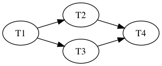

# Message Flow

A pipeline is an explicit contract, declared upfront, for how tasks are linked together.

This diverges slightly from how bolts work in Storm. Where its currently possible to branch bolts based on some tuple input in Storm, it's not currently possible to branch pipeline tasks in Tempest. (Future work could enable this possibility, though).

When a topology moves a source message into the pipeline the message flow looks like this:

- A source message is delivered into the root task (i.e. first defined pipeline task)

- Handling a root task may end up with one of these results:
    1. Return the original message for descendent tasks
    2. Return a set of newly generated messages for descendent tasks
    3. Return nothing
    4. Return an error

- After every task edge in the pipeline is visited, the original message is then acknowledged with the source.

Take this pipeline as an example:



A message flow might look like this:

1. A source message with msg_id=1 is handled by T1.
2. T1 generates 10 new messages as a result.
    - 10 messages for T2
    - 10 messages for T3
3. These 10 messages are then handled by T2 & T3.
    - T2 generates 5 new messages for each of the 10 messages from T1 (5 x 10 = 50 new messages) for T4
    - T3 generates no messages
4. T4 handles 50 new messages from T2 and no messages from T3.
5. When T4 returns results for all 50 messages it handled from T2 we can finally ack the original msg_id=1 with the source.

## Pipeline Aggregation

In the above example, how do we know when all 10 messages from Edge (T1, T2) are processed by T2?

Internally, Tempest stores pipeline state for each edge and message index (i.e. message generated by T1 that were processed by T2).

This state is used to determine when a task edge is completely acknowledged as visited (i.e. all messages sent from the left node are completely processed by the right node).

If a task generates new messages, we need to aggregate them until the task edge is acknowledged as visited. Only when the edge is acknowledged will the aggregated messages be released into the descendant tasks.

Now, what happens if a task generates no messages at all? In this case, all descendant task edges are automatically marked as visited.

## Example

Using the above Pipeline graph example, here's how it would look in code:

```rust
use tempest::prelude::*;

// Static task names
static T1: &'static str = "T1";
static T2: &'static str = "T2";
static T3: &'static str = "T3";
static T4: &'static str = "T4";

#[derive(Default)]
struct T1 {}
impl task::Task for T1 {

    fn name(&self) -> &'static str {
        T1
    }

    fn handle(&mut self, _msg: Msg) -> task::TaskResult {

        // This response is contrived to show new message
        // generation as an example.
        // New messages are just `Msg` types
        // (i.e. byte vectors)

        Ok(Some(vec![
            b"Msg1".to_vec(),
            b"Msg2".to_vec(),
            b"Msg3".to_vec(),
            b"Msg4".to_vec(),
            b"Msg5".to_vec(),
            b"Msg6".to_vec(),
            b"Msg7".to_vec(),
            b"Msg8".to_vec(),
            b"Msg9".to_vec(),
            b"Msg10".to_vec(),
        ]))
    }
}

#[derive(Default)]
struct T2 {}
impl task::Task for T2 {

    fn name(&self) -> &'static str {
        T2
    }

    fn handle(&mut self, _msg: Msg) -> task::TaskResult {
        // Handle all messages generated by T1 here...
        // Return results for T4
        Ok(Some(vec![
            b"Msg11".to_vec(),
            b"Msg12".to_vec(),
            b"Msg13".to_vec(),
            b"Msg14".to_vec(),
            b"Msg15".to_vec(),
        ]))
    }
}

#[derive(Default)]
struct T3 {}
impl task::Task for T3 {

    fn name(&self) -> &'static str {
        T3
    }

    fn handle(&mut self, _msg: Msg) -> task::TaskResult {
        // Handle message generated by T1 here...
        // Return empty result for T4
        Ok(None)
    }
}

#[derive(Default)]
struct T4 {}
impl task::Task for T4 {

    fn name(&self) -> &'static str {
        T4
    }

    fn handle(&mut self, _msg: Msg) -> task::TaskResult {
        // Handle message here...
        // Return empty result
        Ok(None)
    }
}

fn main() {
    // First, start by registering all task instances
    // The first task is turned into the "root" task
    // After that, we can define the edges...
    let pipeline = Pipeline::default()
        .task(T1::default())
        .task(T2::default())
        .task(T3::default())
        .task(T4::default())
        .edge(T1, T2)
        .edge(T1, T3)
        .edge(T2, T4)
        .edge(T3, T4);
    assert_eq!(pipeline.len(), 4);
}

```

## Pipeline Errors

Any message handled by a task that generates an error will cause the original source message to go into an error state.

Once an error state occurs for a given source message, all task processing will cease, and the topology failure policy will handle next steps.
